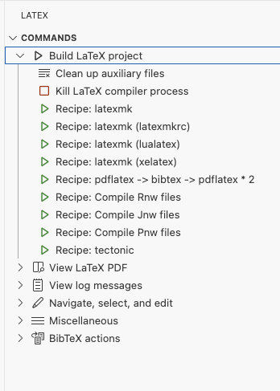

# latex-public
This repository gives a boilerplate code to start with LaTeX

#### we will be understanding what all we need in vs code to create a sample PDF using `LaTeX`

The project is supported by [`devcontainers`](https://docs.github.com/en/codespaces/setting-up-your-project-for-codespaces/adding-a-dev-container-configuration/introduction-to-dev-containers). Make sure you have this [`VS Code`](https://marketplace.visualstudio.com/items?itemName=ms-vscode-remote.remote-containers) extension (mandatory)

Later, open VS Code Command Palette.

**Mac** : `Shift` + `Command` + `P`  
**Windows/Linux** : `Ctrl` + `Shift` + `P`  

Select `Dev Containers: Rebuild and Reopen in Containers` if you are building for the first time or `Dev Containers: Reopen in Containers` if you have existing container.

#### 1. Understanding LaTeX

We need another VS Code extension that helps us writing `LaTeX` code. it is already included in `devContainers.json` file. however, here is the [link](https://marketplace.visualstudio.com/items?itemName=James-Yu.latex-workshop).

- The project requires `.tex` to build a `PDF`.
- Depending upon the package you use in the project, it requires a different compiler to produce output.
- As soon as you open the `.tex` file, the default compiler runs in the background and it generates a PDF as you make changes to `.tex` file.
- make sure to explicitly build using the desired compiler required by the package. 
- The example code uses a package to generate QR code. hence I use `XeLaTeX` compiler to generate a PDF.

 

#### 2. Online Templates

